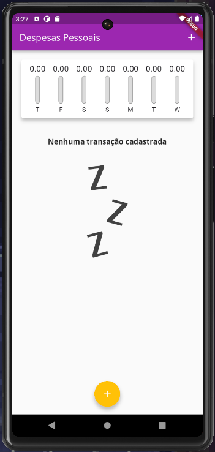
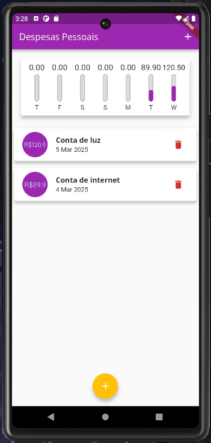

Personal Expenses Tracker

This is a Flutter application developed in Dart to manage personal expenses,
allowing users to add and delete expenses associated with the current week's schedule.

Current Features:

- Add personal expenses with a date.

- List expenses for the current week.

- Delete expenses.

Future Features

- Edit added expenses.

- Calculate and display the total spent during the week.

- Calculate and display the total spent during the month.

